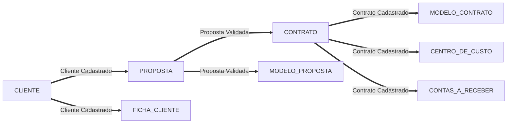
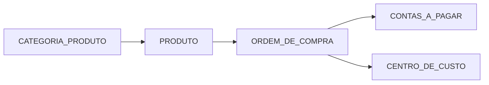
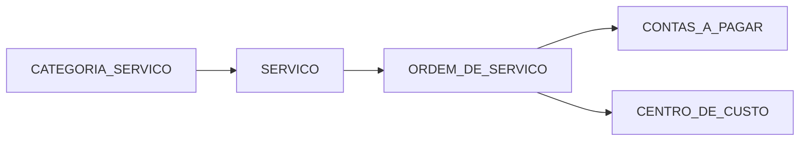

# 3Marias

## Team

| Team Members                      | Core Function     |
|-----------------------------------|-------------------|
| Francisco Wilson Rodrigues Junior | Software Engineer |

## Architecture

### General







### Backend

### Frontend

## Technologies

### Backend Technologies

- PHP 8-apache
- MySQL 5.7
- Laravel
- Sanctum
- Rest APIs
- Docker
- PHPUnit

### Frontend Technologies

- ReactJs
- Bootstrap
- CryptoJS

### AWS

- Apply these changes on each bucket

```json
{
    "Version": "2008-10-17",
    "Statement": [
        {
            "Sid": "AllowPublicRead",
            "Effect": "Allow",
            "Principal": {
                "AWS": "*"
            },
            "Action": [
                "s3:GetObject"
            ],
            "Resource": [
                "arn:aws:s3:::bucket_name/*"
            ]
        }
    ]
}
```

## Changelog